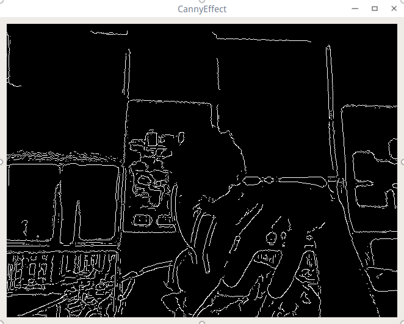

## 边缘检测　
边缘检测是使用了opencv的Canny( InputArray image, OutputArray edges,double threshold1, double threshold2,int apertureSize=3, bool L2gradient=false )算子进行边缘检测的，我们进行边缘检测前需要把彩色图转换成灰色图，然后通过模糊操作进行降噪，最后才通过Canny算子检测。

Widget.h

```c++

#include "../Widgets/abstractcvvideowidget.h"

class Widget : public AbstractCVVideoWidget
{
    Q_OBJECT

public:
    bool updateFrame(const Mat &frameData);
private:
    Mat m_edges;
};

```

Widget.cpp

```c++

#include "widget.h"

bool Widget::updateFrame(const Mat &frameData)
{
    cvtColor(frameData, m_edges, CV_RGB2BGR);
    cvtColor(frameData, m_edges, CV_BGR2GRAY);

    blur(m_edges, m_edges, Size(7, 7));

    Canny(m_edges, m_edges, 0, 20, 3);

    QImage img(m_edges.data,m_edges.size().width,m_edges.size().height,QImage::Format_Indexed8);
    const QPixmap& pixmap = QPixmap::fromImage(img);
    setFrame(pixmap);
    return true;
}

```
这次的Widget类直接继承了AbstractCVVideoWidget这个类，然后重写虚函数updateFrame，这样处理数据方便多了。这里的使用了cvtColor()来转换颜色控件，由于Mat的颜色控件拿出来的时候已经被转换成RBG了，所以这里又得转换会BGR再转换灰度图。当然还有其他简短方式等着去挖掘！源码请参考CannyEffect。

截图：


