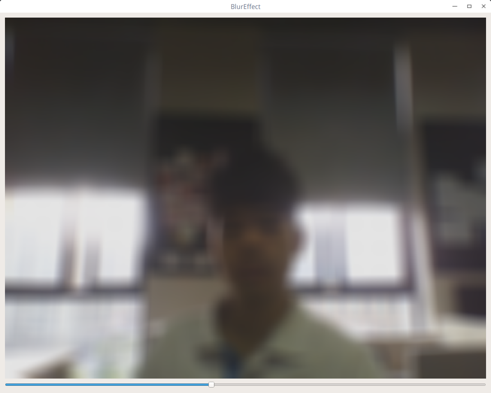

## 模糊效果
模糊效果是使用了opencv的blur(Mat input, Mat ouput, Size blurRadius)函数实现的。

BlurWidget.h

```c++

#include <QObject>
#include "../Widgets/abstractcvvideowidget.h"
#include <QSlider>

class BlurWidget : public AbstractCVVideoWidget
{
    Q_OBJECT
public:
    explicit BlurWidget(QWidget *parent = 0);
    bool updateFrame(const Mat &frameData) Q_DECL_OVERRIDE;

signals:

public slots:
protected:
//    void resizeEvent(QResizeEvent *event);
private:
    QSlider* m_slider;

};

```

BlurWidget.cpp

```c++

#include "blurwidget.h"

BlurWidget::BlurWidget(QWidget *parent):AbstractCVVideoWidget(parent)
{
    m_slider = new QSlider(this);
    m_slider->setOrientation(Qt::Horizontal);
    m_slider->setMaximum(50);
    m_slider->setMinimum(1);
//    m_layout->addWidget(m_slider);
    this->layout()->addWidget(m_slider);
}

bool BlurWidget::updateFrame(const Mat &frameData)
{

    Mat dstImg;
    blur(frameData, dstImg, Size(m_slider->value(),m_slider->value()));

    QImage img(dstImg.data,dstImg.size().width,dstImg.size().height,QImage::Format_RGB888);
    const QPixmap& pixmap = QPixmap::fromImage(img.scaled(QSize(1200,800),Qt::KeepAspectRatio,Qt::SmoothTransformation));
    setFrame(pixmap);
    return true;
}

//void BlurWidget::resizeEvent(QResizeEvent *event)
//{
//    Q_UNUSED(event)
//    m_slider->setFixedWidth(this->width()-20);
//}

```

结合之前的介绍，这里的代码应该非常好的理解了！主要实现在重写父类虚函数那里进行模糊处理。
效果截图：



