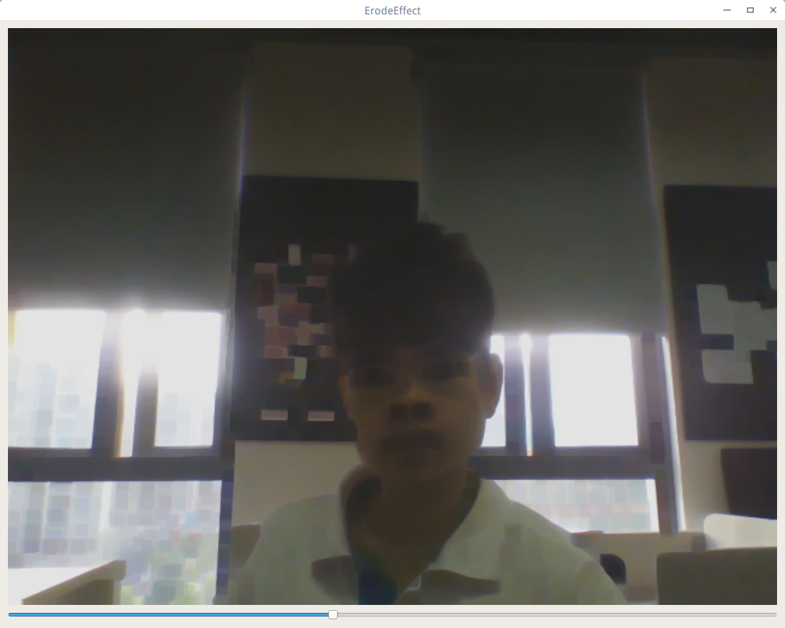
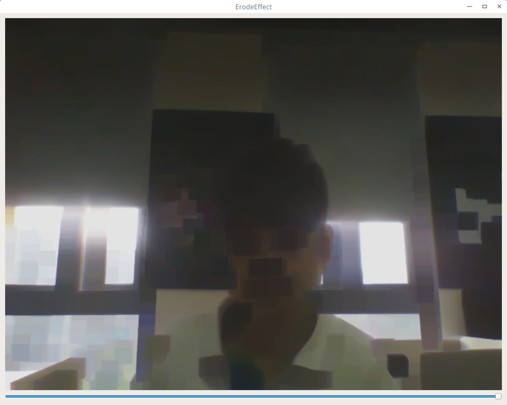

## 腐蚀效果
腐蚀效果是使用了opencv的erode(Mat input, Mat oupt, Mat element)函数实现的，element可以当做一个小小的腐蚀矩形，就是描述图像被腐蚀的程度，矩形越大，腐蚀程度越大。这次使用的代码没有继承抽象类，参考：

CVVideoWidget.h

```c++

#include <QWidget>
#include <QVBoxLayout>
#include <QLabel>
#include "cvvideo.h"
#include <QSlider>

class CVVideoWidget : public QWidget
{
    Q_OBJECT
public:
    explicit CVVideoWidget(QWidget *parent = 0);
    void initUI();
    void initConnections();

signals:
    void morphSizeChanged(const Size& size);

public slots:
    void updateFrame(const Mat& frameData);
    void setMorphRectSize(const Size& size);

private:
    CVVideo m_video;
    Mat m_frameData;
    QLabel *m_frame;
    QVBoxLayout *m_layout;
    Size m_morphRectSize;
    QSlider *m_slider;

};

```

CVVideoWidget.cpp

```c++

#include "cvvideowidget.h"
#include <QPixmap>
#include <QImage>
#include <QDebug>

CVVideoWidget::CVVideoWidget(QWidget *parent) : QWidget(parent)
{
    initUI();
    initConnections();
    m_morphRectSize = Size(1,1);
}

void CVVideoWidget::initUI()
{
    m_layout = new QVBoxLayout;
    m_frame = new QLabel(this);
    m_slider = new QSlider(this);
    m_slider->setOrientation(Qt::Horizontal);
    m_slider->setMaximum(20);
    m_slider->setMinimum(1);
    m_layout->addWidget(m_frame);
    m_layout->addWidget(m_slider);
    setLayout(m_layout);
}

void CVVideoWidget::initConnections()
{
    connect(&m_video, SIGNAL(frameChanged(Mat)),this, SLOT(updateFrame(Mat)));
    connect(m_slider, &QSlider::valueChanged, this, [this](const int& val){
        setMorphRectSize(Size(val,val));
    });
}

void CVVideoWidget::setMorphRectSize(const Size &size)
{
    m_morphRectSize = size;
}

void CVVideoWidget::updateFrame(const Mat &frameData)
{
    m_frameData = frameData;

    //erode
    Mat element = getStructuringElement(MORPH_RECT,m_morphRectSize);
    Mat dstFrameData;
    erode(m_frameData, dstFrameData, element);

    QImage img(dstFrameData.data,dstFrameData.size().width,dstFrameData.size().height,QImage::Format_RGB888);
    const QPixmap& pixmap = QPixmap::fromImage(img.scaled(QSize(1200,800),Qt::KeepAspectRatio,Qt::SmoothTransformation));
    m_frame->setPixmap(pixmap);
}

```
效果截图：





源码在ErodeEffect这个项目中，大家可以直接全部克隆了一个个运行看看效果。
